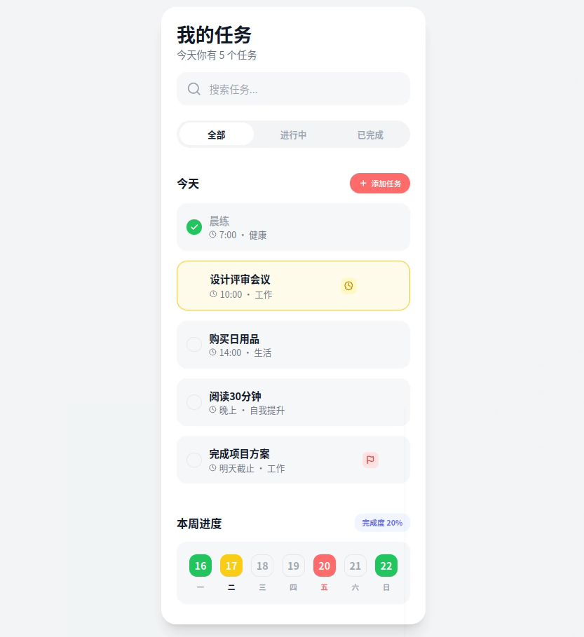
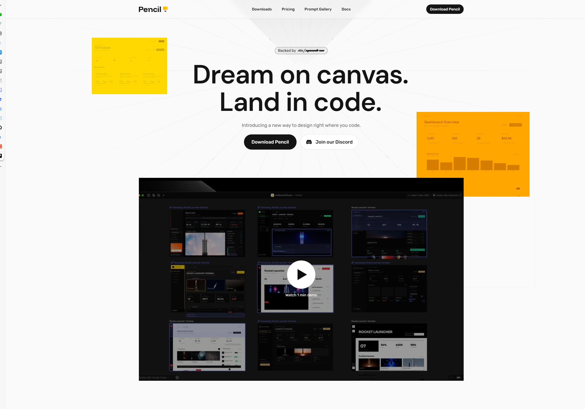

# Todo App - 任务管理应用

一个美观现代的任务管理应用，使用 Next.js 14 + Tailwind CSS 构建。

## 🎸 界面预览



## 💭 关于 Pencil MCP 的使用体验

本项目使用 **GLM 4.7** 模型接入 Pencil MCP 进行开发。

**界面绘制方面**：体验良好，可能是 Pencil 的结构化输出加成，生成界面组件的速度很快，代码质量也还不错。

**流程图绘制方面**：体验较差，尝试做类似 draw.io 的流程图时效果一塌糊涂。不过这可能与国产模型的能力限制有关，不一定是 Pencil 的问题。

总体来说，对于 UI 界面类的生成任务，Pencil MCP 配合适当的模型可以显著提升开发效率。

## 🚀 如何使用 Pencil.dev 构建项目



以下是使用 Pencil.dev 从零开始构建本项目的完整流程：

### 第一步：安装 Pencil.dev

访问 [pencil.dev](https://pencil.dev) 下载并安装 Pencil。安装完成后，它会自动为你添加一个 **Claude MCP** 插件。

### 第二步：配置第三方模型接入

1. 打开 Pencil.dev 界面
2. 在设置中选择 **"使用 Claude 第三方模型接入"**
3. 准备好你的国产模型 API Key 或 Claude 中转站服务

### 第三步：配置 Claude Code

1. 打开 Claude Code
2. 在配置文件中设置你的国产模型（如 GLM、DeepSeek 等）或 Claude 中转站
3. 确保 Pencil MCP 已正确连接

### 第四步：在 Pencil 中设计界面

1. 回到 Pencil 界面
2. 通过**自然语言对话**描述你想要的界面，例如："帮我做一个 Todo App，要有搜索、筛选、任务管理功能"
3. Pencil 会自动生成界面设计
4. 你可以继续通过对话或手动修改来优化设计，直到满意为止
5. 保存项目，导出为 `*.pen` 设计源文件

### 第五步：使用 Pencil MCP 生成代码

1. 回到 Claude Code
2. 告诉 Claude："使用 Next.js + Tailwind CSS，把 `todo.pen` 源文件用 Pencil MCP 转换成前端界面"
3. Claude 会调用 Pencil MCP 读取设计文件并生成对应的前端代码
4. 根据需要调整和完善代码

就这么简单！🎉

## 功能特性

- ✅ **任务管理**: 添加、编辑、删除任务
- 🔍 **实时搜索**: 快速搜索任务标题和分类
- 📋 **状态过滤**: 全部 / 进行中 / 已完成 任务筛选
- ⏰ **任务状态**: 标记任务为完成、进行中、重要
- 💾 **本地持久化**: 使用 LocalStorage 自动保存数据
- 📊 **周进度追踪**: 可视化展示本周完成度
- 🎨 **精美设计**: 基于 Pencil 设计稿还原的现代化 UI

## 技术栈

- **框架**: Next.js 14 (App Router)
- **语言**: TypeScript
- **样式**: Tailwind CSS
- **图标**: Lucide React
- **字体**: DM Sans + Bricolage Grotesque

## 设计来源

本应用的设计原型使用 **[Pencil](https://pencil.dev)** 制作 - 一个强大的 UI 设计工具。设计文件 `todo.pen` 包含了完整的界面设计，包括：

- 响应式布局
- 精心设计的色彩系统
- 圆角和阴影细节
- 状态指示视觉反馈

## 快速开始

### 安装依赖

```bash
npm install
```

### 运行开发服务器

```bash
npm run dev
```

在浏览器中打开 [http://localhost:3000](http://localhost:3000) 查看效果。

### 构建生产版本

```bash
npm run build
npm start
```

## 项目结构

```
try-pencil/
├── app/
│   ├── globals.css      # 全局样式和字体
│   ├── layout.tsx       # 根布局
│   └── page.tsx         # 主页面（Todo App 组件）
├── todo.pen             # Pencil 设计源文件
├── package.json
├── tsconfig.json
├── tailwind.config.ts
└── next.config.js
```

## 核心功能说明

### 任务操作
- **添加任务**: 点击"添加任务"按钮，填写任务信息
- **编辑任务**: 点击任务卡片即可编辑
- **完成任务**: 点击左侧复选框
- **标记进行中**: 鼠标悬停显示时钟图标按钮
- **标记重要**: 鼠标悬停显示旗帜图标按钮
- **删除任务**: 鼠标悬停显示删除按钮

### 数据持久化
所有任务数据自动保存到浏览器的 LocalStorage，刷新页面数据不会丢失。

## 设计亮点

- **渐变配色**: 使用精心挑选的色彩系统
- **圆角设计**: 统一的圆角风格，视觉柔和
- **状态反馈**: 不同状态有对应的视觉样式
  - 已完成: 灰色文字 + 绿色对勾
  - 进行中: 黄色边框背景
  - 重要: 红色标签

